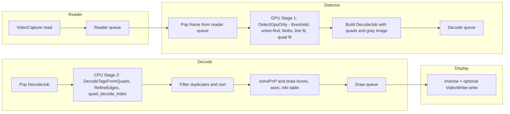
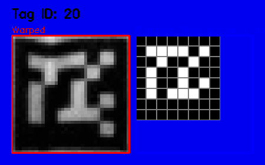

# Standalone CUDA AprilTag Detector

A high-performance CUDA-based AprilTag detection system with coordinate scaling fixes, duplicate filtering, and 3D visualization capabilities.

## Overview

This project provides a standalone implementation of the CUDA AprilTag detector based on the [Team766/apriltags_cuda](https://github.com/Team766/apriltags_cuda) repository, with a focus on **high-throughput, low-latency detection and visualization**. Key enhancements over the upstream code include:

- **Correct Coordinate Scaling**: Fixes GPU detector coordinates from decimated space back to full-resolution image space.
- **Robust Duplicate Filtering**: Removes false positives and duplicates while keeping the best detection per tag ID.
- **3D Pose Visualization**: Real-time 3D pose (axes + distance) using OpenCV `solvePnP` / `drawFrameAxes` (thread-safe).
- **2-Stage GPU/CPU Pipeline**: GPU Stage 1 for quad extraction, CPU Stage 2 for decoding, connected via a decode queue.
- **Multi-Threaded I/O and Display**: Separate threads for frame reading, detection, CPU decode/drawing, and display/write.
- **Config-Driven Tuning**: All key parameters (detector, camera, queues, reporting) are controlled via `config.txt`.
- **Built-In Benchmarking**: Detailed per-stage timing and detection histograms for reproducible performance measurements.

## Features

- **CUDA-accelerated AprilTag detection**
  - GPU pre-processing and quad extraction with highly optimized CUDA kernels.
  - CPU-based tag decoding using the cgpadwick apriltag library.

- **2-stage detection pipeline with 4-thread architecture**
  - Stage 1 (GPU) on frame N+1; Stage 2 (CPU decode + drawing) on frame N.
  - Dedicated threads for frame reading, detection, decode/drawing, and display/write.

- **Accurate coordinate and pose estimation**
  - Correct coordinate scaling from decimated to full-resolution space.
  - 3D pose estimation via OpenCV `solvePnP` with configurable camera and distortion parameters.

- **Enhanced visualization**
  - Tag outlines, ID labels, and color-coded 3D axes overlaid on the video.
  - Compact top-left info table with FPS, ID, X, Y, Z, distance, and normalized probability for each tag.

- **Configurable and measurable**
  - Detector, filtering, camera, threading, and reporting options in `config.txt`.
  - Built-in per-stage timing and detection histograms for each run.

- **Multiple tag families**
  - Supports `tag36h11`, `tag25h9`, and other cgpadwick families.

## Requirements

- **CUDA Toolkit**: 12.2 or compatible
- **CMake**: 3.15 or higher
- **Ninja**: Build system
- **OpenCV**: Built with CUDA support (automatically built during setup)
- **System Libraries**:
  - `libapriltag` (installed system-wide at `/usr/local/lib/libapriltag.so`)
  - Headers at `/usr/local/include/apriltag/`

## Directory Structure

```
StandAlone/
├── src/
│   ├── apriltags_cuda/          # Main CUDA AprilTag detector
│   │   ├── src/                  # Core detection code
│   │   ├── tools/                # Utility tools
│   │   │   ├── video_visualize_fixed.cu  # Visualization with fixes
│   │   │   ├── compare_detectors.cu      # CPU vs GPU comparison
│   │   │   └── debug_coordinates.cu      # Coordinate debugging
│   │   └── CMakeLists.txt
│   └── apriltag_cgpadwick/       # CPU AprilTag library (dependency)
├── input/                        # Input video files
│   ├── Stable.avi
│   └── Moving.avi
├── output/                       # Generated video outputs (excluded from git)
├── reports/                      # Performance reports and analysis
│   ├── VISUALIZATION_UPDATE_SUMMARY.md
│   ├── PERFORMANCE_TIMING_REPORT.md
│   └── [other analysis reports]
├── config.txt                    # Configuration file for detector parameters
├── setup_env.sh                  # Environment setup script
└── README.md                     # This file
```

## Setup

1. **Set up environment** (required before building):
```bash
source setup_env.sh
```

2. **Build the project**:
```bash
cd src/apriltags_cuda/build
cmake -G Ninja -DCMAKE_BUILD_TYPE=Release \
  -DCMAKE_CUDA_ARCHITECTURES=86 \
  -DCMAKE_CUDA_COMPILER=/usr/local/cuda-12.2/bin/nvcc \
  -DCMAKE_CUDA_STANDARD=17 ..
ninja -j4
```

**Note**: Adjust `CMAKE_CUDA_ARCHITECTURES` for your GPU:
- RTX 2050/2060/2070/2080: `86`
- RTX 3050/3060/3070/3080: `86`
- RTX 3090/4090: `89`
- Check your GPU compute capability: `nvidia-smi --query-gpu=compute_cap --format=csv`

## Usage

### Video Visualization with 3D Tags

Display or generate output videos with 3D tag visualization, real-time information table, and detailed timing:

```bash
cd src/apriltags_cuda/build
# Display only (default)
./video_visualize_fixed --video /home/nav/Apriltag/StandAlone/input/Stable.avi

# With output file
./video_visualize_fixed \
  --video /home/nav/Apriltag/StandAlone/input/Stable.avi \
  --output /home/nav/Apriltag/StandAlone/output/Stable_3d_fixed.avi \
  --family tag36h11 \
  --tag_size 0.305
```

**Options**:
- `--video`: Input video path (required)
- `--output`: Output video path (optional, if omitted, only displays on screen)
- `--family`: Tag family (default: `tag36h11`)
- `--tag_size`: Tag size in meters (default: `0.305` for 1-foot tags)
- `--min_distance`: Minimum distance for duplicate filtering in pixels (default: `50.0`)

**Visualization Features**:
- **3D Axes**: Color-coded axes showing tag orientation (X=red, Y=green, Z=blue)
- **Tag Outlines**: Yellow rectangles around detected tags
- **Tag IDs**: Green text showing tag ID numbers
- **Information Table**: Compact table in top-left corner displaying:
  - Current FPS
  - Per-tag data: ID, X, Y, Z coordinates, Distance, Probability
  - All values with 2 decimal precision

### Compare CPU vs GPU Detectors

Compare detection accuracy between CPU and GPU implementations:

```bash
./compare_detectors \
  --video /home/nav/Apriltag/input/Stable.avi \
  --family tag36h11 \
  --max_frames 100
```

### Debug Coordinate Transformations

Debug coordinate scaling issues:

```bash
./debug_coordinates \
  --video /home/nav/Apriltag/input/Stable.avi \
  --family tag36h11 \
  --max_frames 10
```

## Key Fixes and Enhancements

### 1. Coordinate Scaling Fix

The GPU detector processes images at decimated resolution (typically 2x decimation) for performance. The original implementation had issues with coordinate scaling, causing detections to appear at incorrect locations.

**Fix**: Added coordinate scaling in `video_visualize_fixed.cu` to convert from decimated space to full resolution:
```cpp
void scale_detection_coordinates(apriltag_detection_t *det, double decimate_factor)
```

### 2. Duplicate Detection Filtering

The GPU detector can produce multiple detections for the same physical tag. Added filtering to keep only the best detection per tag ID based on decision margin.

**Implementation**: `filter_duplicates()` function filters by:
- Tag ID (keeps best decision margin per ID)
- Coordinate validity (removes detections outside image bounds)
- Minimum distance threshold

### 3. Distance Measurement

Added real-time distance calculation from camera to tag using pose estimation:
- Calculates translation vector magnitude
- Displays distance in meters above each tag
- Format: `ID:X Dist:Y.XXXm`

### 4. Tag Size Configuration

Default tag size set to 0.305m (1 foot) for accurate distance measurements. Adjust with `--tag_size` parameter if your tags are different sizes.

### 5. Enhanced Visualization

Recent improvements to the visualization system:

- **Information Table**: Compact table in the top-left corner displaying:
  - Current processing FPS (from the detector thread).
  - Per-tag information: ID, X, Y, Z coordinates, Distance (meters), Probability (normalized 0–1).
  - All numeric values with 2 decimal precision.
- **Optimized Layout**: Small fonts and tight spacing to show multiple tags cleanly.
- **3D Visualization**: Color-coded axes (X=red, Y=green, Z=blue) showing tag orientation.
- **Real-time Display**: Live video display with all visualizations overlaid in a dedicated display thread.

See `reports/VISUALIZATION_UPDATE_SUMMARY.md` for more detail.

### 6. Two-Stage GPU/CPU Pipeline and Multi-Threading

- **GPU Stage 1 (DetectGpuOnly)**:
  - Converts the input frame to grayscale and decimated form.
  - Runs thresholding, connected components, blob filtering, line fitting, and quad fitting on the GPU.
  - Produces quad candidates and a preprocessed grayscale image on the host.

- **CPU Stage 2 (DecodeTagsFromQuads)**:
  - Decodes tags from the GPU-produced quads and grayscale buffer using a dedicated `apriltag_detector_t` and workerpool.
  - Applies additional duplicate filtering by center distance.
  - Computes 3D pose and renders overlays + the info table on a per-frame basis.

- **Threaded Architecture**:
  - Reader thread: prefetches frames into a bounded queue.
  - Detector thread: runs GPU Stage 1 and enqueues `DecodeJob`s.
  - Decode thread: runs CPU Stage 2 and enqueues fully-rendered frames.
  - Display/write thread: owns `imshow` / `waitKey` and optional `VideoWriter`, fully decoupled from detection.

### 7. Configurable Reporting and Histograms

- Per-run summary includes:
  - Total frames processed and average detector-thread FPS.
  - Per-stage timing: frame read, detect total, CUDA ops, CPU decode, scaling, filtering, drawing, and write.
  - Detection histogram **after filtering** (0/1/2/3/4 tags per frame).
- Optional pre-filter reporting:
  - Controlled via `[reporting]` section in `config.txt`:
    - `show_before_filter: true` to also print pre-filter totals and histograms.
    - Disabled by default to keep the console output minimal during normal runs.

## Algorithm and Pipeline

### Logical Detection Stages

At a high level, the detector runs the following stages for each frame:

1. **Frame acquisition (CPU, Reader thread)**  
   - Read YUYV/BGR frame from `cv::VideoCapture`.  
   - Push raw frame into a bounded **reader queue** for the detector thread.

2. **GPU preprocessing and quad extraction (GPU, Stage 1)**  
   Implemented in `GpuDetector::DetectGpuOnly()` in `apriltag_gpu.cu`:
   - **Color → grayscale + decimation** (`CudaToGreyscaleAndDecimateHalide`):
     converts the frame to grayscale and downsamples by `quad_decimate`.
   - **Local min/max thresholding**:
     builds a min/max pyramid and produces a binary (thresholded) image.  
   - **Connected components (union–find)**:
     labels foreground regions in the thresholded image.
   - **Blob filtering and compaction**:
     removes tiny/non-AprilTag-like components using CUDA prefix/scan+select.  
   - **Line fit and edge peak extraction**:
     fits lines to blob boundaries and finds strong gradient peaks that could
     form tag edges.
   - **Quad fitting** (`FitQuads`):
     groups peaks into quadrilaterals and fits accurate corner locations
     in decimated coordinates.
   - **Coordinate adjustment** (`UpdateFitQuads` + `AdjustPixelCenters`):
     converts quad corners into full-resolution image coordinates.
   - The final GPU outputs are:
     - A vector of **quad corners** (candidate tags) in full-res coordinates.
     - The full-resolution **grayscale image** copied back to host memory.

3. **CPU quad decoding and tag ID extraction (CPU, Stage 2)**  
   Implemented in `DecodeTagsFromQuads()` in `apriltag_detect.cu`, running in
   the dedicated **decode thread**:
   - For each quad:
     - Optionally **refine edges** (`RefineEdges`) in full-resolution space,
       using the camera intrinsics and distortion coefficients.
     - **Sample the tag grid** and run `quad_decode_index()` to recover the
       tag family, ID, and decision margin.
   - **Reconcile detections** (`reconcile_detections`) and build a single list
     of `apriltag_detection_t*`.
   - **Duplicate filtering by center**:
     `FilterDuplicateDetectionsByCenter` keeps only the best detection per ID
     based on decision margin and spatial distance.
   - **Sorting**:
     detections are sorted by quality for stable visualization and analysis.

4. **Pose estimation and visualization (CPU, Decode thread)**  
   For each surviving detection:
   - Use OpenCV **`solvePnP`** with the camera matrix, distortion coefficients,
     and the 4 tag corners to compute the 3D pose (rotation/translation).  
   - Draw:
     - **3D axes** using `cv::drawFrameAxes`.  
     - **Tag outline** (yellow box) and **ID label** on the tag.  
   - Aggregate per-tag pose info (`TagPoseInfo`) and render the **top-left
     info table**:
     - FPS
     - Tag ID, X, Y, Z, Distance, and normalized probability (0–1).

5. **Display and optional video writing (CPU, Display/Writer thread)**  
   - Pop fully rendered frames from a bounded **draw queue**.  
   - Call `cv::imshow` / `cv::waitKey` for live display.  
   - Optionally write frames to `cv::VideoWriter` when `--output` is set.

### Threaded Execution Pipeline (Phase 2)

The current implementation runs these stages as a **2-stage detection pipeline**
over multiple frames:

- **Stage 1 (GPU)** on frame **N+1** in the **main detector thread**.  
- **Stage 2 (CPU decode + drawing)** on frame **N** in the **decode thread**.  

This creates an overlapped pipeline across four threads:



This design ensures that:
- Frame reading, GPU work, CPU decode, and display/write all run in parallel.  
- Bounded queues between stages prevent unbounded latency growth and provide
  clear back-pressure behavior.

## Performance

### Benchmark Setup

All numbers below were obtained with:

- **Resolution**: 1280×1024 grayscale (input videos are `yuv420p` treated as 8-bit single-channel).
- **Tool**: `video_visualize_fixed` with live display enabled and no output file.
- **Videos**:
  - `input/Stable.avi`: mostly static scene with a 4-tag grid.
  - `input/Moving.avi`: camera/tag motion with varying tag counts per frame.

These are **example test results** for this repository; your hardware and scenes will produce different numbers.

### Stable.avi (static scene)

- **Frames processed**: 2018  
- **Total time**: 6.46 s  
- **Average processing FPS (detector thread)**: **312.39 FPS**

- **Detections after filtering**:
  - Total: **2011**
  - Average per frame: ≈ **1.00 tags/frame**
  - Frame detection histogram (after filtering):
    - **1 tag**: 2011 frames

- **Per-frame timing (ms, averages)**:
  - **Frame read**: 0.69
  - **Detect total**: 1.80
    - CUDA ops: 1.78
    - CPU decode: 0.94
  - **Scale coordinates**: 0.00
  - **Filter duplicates**: 0.00
  - **Draw (axes/text)**: 1.02
  - **Write frame**: 0.00 (display-only run)

### Moving.avi (moving scene)

- **Frames processed**: 1916  
- **Total time**: 6.05 s  
- **Average processing FPS (detector thread)**: **316.66 FPS**

- **Detections after filtering**:
  - Total: **1378**
  - Average per frame: ≈ **0.72 tags/frame**
  - Frame detection histogram (after filtering):
    - **0 tags**: 534 frames
    - **1 tag**: 1378 frames

- **Per-frame timing (ms, averages)**:
  - **Frame read**: 0.69
  - **Detect total**: 1.82
    - CUDA ops: 1.79
    - CPU decode: 0.92
  - **Scale coordinates**: 0.00
  - **Filter duplicates**: 0.00
  - **Draw (axes/text)**: 0.76
  - **Write frame**: 0.00 (display-only run)

### Multi-Threaded Architecture Impact

- Frame reading is **fully overlapped** with detection and contributes ~0.7 ms in parallel.
- Display and optional video writing run in a dedicated thread and **do not block** the detector.
- The detector thread spends ~**1.8 ms/frame** in the combined GPU+CPU detection pipeline  
  (theoretical throughput ≈ **550 FPS** ignoring I/O and drawing).

See `reports/THREADING_ARCHITECTURE_AND_TEST_RESULTS.md` for more details on the threading model and timing methodology.

### Detection Quality
- **Detection accuracy**: ~99%+ with coordinate fixes
- **Coordinate accuracy**: <1 pixel average error vs CPU detector
- **False positive rate**: Significantly reduced with duplicate filtering

See `reports/PERFORMANCE_TIMING_REPORT.md` for detailed timing analysis.

## Configuration

All detector parameters can be configured via `config.txt`. Key settings include:

- **Detector parameters**: `quad_decimate`, filtering thresholds, etc.
- **Camera intrinsics**: Focal length, principal point
- **Distortion coefficients**: Radial and tangential distortion
- **Tag size**: Physical tag size in meters
- **Filtering parameters**: Minimum distance for duplicate filtering
- **Threading parameters**:
  - `[prefetching]`: Frame prefetching queue size and policy
  - `[writer]`: Video output queue size and policy
  - `[reporting]`: Controls whether pre-filter stats are printed

See `config.txt` for all available options and default values. Common keys:

- `[detector]`
  - `family`: Tag family (e.g. `tag36h11`)
  - `quad_decimate`: Decimation factor (must match GPU detector assumptions, typically 2.0)
  - `nthreads`, `refine_edges`, `debug`
- `[filtering]`
  - `min_distance_for_duplicates`: Minimum pixel distance for duplicate filtering
- `[camera]` / `[distortion]`
  - Camera intrinsics and distortion coefficients used for pose estimation.
- `[prefetching]`
  - `enabled`, `queue_size`, `drop_oldest`
- `[writer]`
  - `queue_size`, `drop_oldest`
- `[reporting]`
  - `show_before_filter`: Print pre-filter stats and histograms when `true`.

## Tools / GUI Application

The project includes a comprehensive Qt-based GUI application (`apriltag_debug_gui`) located in the `Tools/` directory for interactive debugging and analysis of AprilTag detection.

### Overview

The GUI provides a multi-tab interface for:
- **Live camera capture and analysis** (Capture tab)
- **Real-time algorithm testing** (Algorithms tab)
- **Fisheye distortion correction** (Fisheye Correction tab)
- **Application settings management** (Settings tab)
- **Image processing and pattern analysis** (Processing tab)

### Key Features

#### 1. Capture Tab
- **Multi-camera support**: V4L2 (USB webcams) and MindVision cameras
- **Live preview**: Real-time video feed with AprilTag detection overlay
- **Camera controls**: Exposure, gain, brightness, contrast, saturation, sharpness
- **Pattern visualization**: Automatic extraction and display of tag patterns
- **Image capture**: Save frames with automatic filename generation

#### 2. Pattern Visualization (Capture Tab)

When tags are detected, the GUI automatically displays a comprehensive pattern visualization showing:

- **One tag per row**: Each detected tag gets its own row for clear organization
- **Three visualization boxes per tag**:
  1. **Warped Image** (left): Original warped tag image with border/extraction region visualization
  2. **Gray Color Box** (middle): 8x8 grid showing actual grayscale pixel values (0-255) as visual colors
  3. **Digitized Pattern** (right): 8x8 grid with black border and 6x6 data region (clean black/white pattern)

**Example Pattern Visualizations**:


*Pattern visualization for Tag ID 3 showing warped image, gray color values, and digitized pattern*


*Pattern visualization for Tag ID 20 showing warped image, gray color values, and digitized pattern*

The gray color box displays the actual pixel values extracted from the tag, making it easy to see:
- Border cells (black, outer ring)
- Data region cells with their exact grayscale values (0-255)
- Visual representation of the analog color values

The digitized pattern shows the binary interpretation (black/white) without text labels for a clean visualization.

#### 3. Algorithms Tab
- **Real-time detection**: Live camera feed with GPU-accelerated AprilTag detection
- **Multi-threaded FPS display**: Shows FPS for three threads:
  - **Read FPS**: Frame capture/reading thread
  - **Decode FPS**: Detection/decoding thread
  - **Display FPS**: Display/rendering thread
- **Quality metrics**: Decision margin, Hamming distance, and detection statistics
- **Pose estimation**: 3D pose data (translation and rotation) when calibration is loaded

#### 4. Settings Tab
- **Fisheye calibration settings**:
  - Load calibration on startup
  - Configurable calibration file path
  - Enable fisheye correction for MindVision cameras by default
- **Per-camera settings management**:
  - Select camera from dropdown
  - Edit exposure, gain, brightness, contrast, saturation, sharpness, and mode
  - Settings automatically saved/loaded per camera
  - Settings persist across application restarts

#### 5. Processing Tab
- **Stage Selection** (at top): Compact control panel for selecting visualization stages
- **Side-by-side image comparison**: Load and compare two images
- **Stage-by-stage debugging**: Visualize preprocessing, edge detection, detection, and advanced stages
- **Quality metrics**: Detailed metrics for each processing stage
- **Pattern extraction**: Extract and analyze 6x6 binary patterns from tags

#### 6. Fisheye Correction Tab
- **Calibration management**: Load existing YAML calibration files
- **Interactive calibration**: 6x6 checkerboard-based calibration process
- **Visual preview**: Side-by-side original vs. corrected image comparison
- **Enable/disable toggle**: Control fisheye correction application

### Building the GUI

```bash
cd Tools
mkdir build && cd build
cmake ..
make apriltag_debug_gui -j$(nproc)
```

The executable will be in `Tools/build/bin/apriltag_debug_gui`.

### Configuration Files

- **Main config**: `~/.apriltag_debug_gui_config.yaml` (YAML format)
  - Stores fisheye calibration settings
  - References camera settings file
  
- **Camera settings**: `camera_settings.txt` (text format, in working directory)
  - Stores per-camera settings (exposure, gain, brightness, etc.)
  - Format: `[Camera]` and `[Settings]` sections per camera

### Usage Example

1. **Start the GUI**:
   ```bash
   ./Tools/build/bin/apriltag_debug_gui
   ```

2. **Capture Tab**:
   - Select camera from dropdown (defaults to "None")
   - Camera preview starts automatically
   - Detected tags show green boxes with IDs
   - Pattern visualization appears automatically in the right panel

3. **Settings Tab**:
   - Configure fisheye calibration auto-load
   - Select camera and adjust settings
   - Click "Save Settings" to persist changes

4. **Algorithms Tab**:
   - Select camera and algorithm (CPU or Fast AprilTag/GPU)
   - Click "Start" to begin real-time detection
   - View FPS for Read, Decode, and Display threads
   - See quality metrics and pose estimation

For more detailed information, see `Tools/README.md` and `CHANGES.md`.

## Troubleshooting

### Build Issues

1. **CUDA not found**: Ensure CUDA is installed and `CUDA_HOME` is set:
   ```bash
   export CUDA_HOME=/usr/local/cuda-12.2
   ```

2. **OpenCV not found**: OpenCV is built automatically during CMake configuration. If issues occur, check build logs in `src/apriltags_cuda/build/`.

3. **apriltag library not found**: Ensure the CPU apriltag library is installed:
   ```bash
   # Check if installed
   pkg-config --exists apriltag && echo "OK" || echo "Not found"
   ```

### Runtime Issues

1. **Segmentation fault**: Ensure GPU detector is warmed up before processing. The visualization tool includes automatic warmup.

2. **Incorrect distances**: Verify tag size matches your actual tag size:
   ```bash
   # For 1-foot tags (default)
   --tag_size 0.305
   
   # For 6-inch tags
   --tag_size 0.152
   ```

3. **No detections**: Check that:
   - Video path is correct
   - Tag family matches your tags (`tag36h11`, `tag25h9`, etc.)
   - Tags are visible and properly lit in the video

## Development

### Adding New Tools

Tools are located in `src/apriltags_cuda/tools/`. To add a new tool:

1. Create `.cu` file in `tools/`
2. Add executable to `CMakeLists.txt`:
   ```cmake
   add_executable(my_tool tools/my_tool.cu src/apriltag_utils.cu)
   target_link_libraries(my_tool apriltag_cuda ...)
   ```

### Modifying Detection Pipeline

Core detection code is in `src/apriltags_cuda/src/apriltag_detect.cu`. Key functions:
- `GpuDetector::Detect()`: Main detection entry point
- `GpuDetector::DecodeTags()`: Tag decoding and coordinate transformation
- `AdjustPixelCenters()`: Coordinate scaling from decimated to full resolution

## License

This project is based on:
- [Team766/apriltags_cuda](https://github.com/Team766/apriltags_cuda) - CUDA AprilTag detector
- [cgpadwick/apriltag](https://github.com/cgpadwick/apriltag) - CPU AprilTag library

See respective repositories for license information.

## Contributing

When contributing, please:
1. Test with both Stable.avi and Moving.avi
2. Verify coordinate accuracy using `compare_detectors`
3. Update this README if adding new features
4. Follow existing code style and conventions

## Acknowledgments

- Team766 for the CUDA AprilTag implementation
- cgpadwick for the enhanced CPU AprilTag library
- OpenCV team for computer vision libraries
